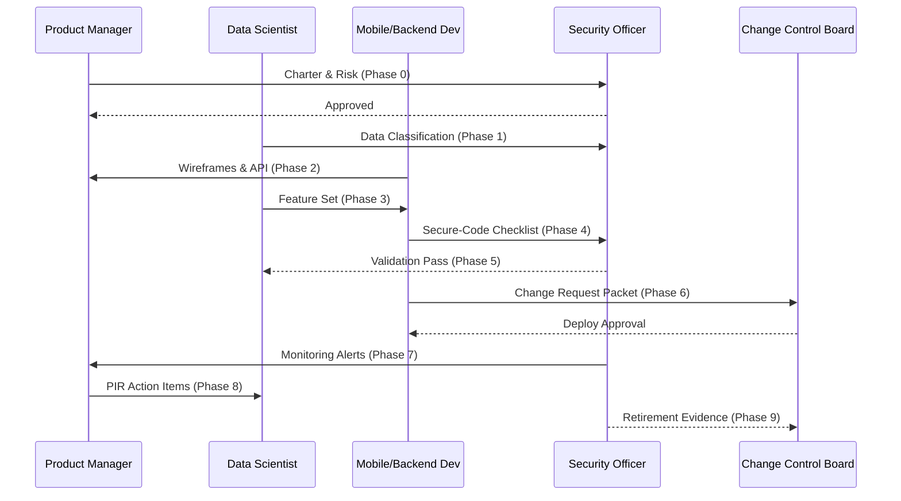
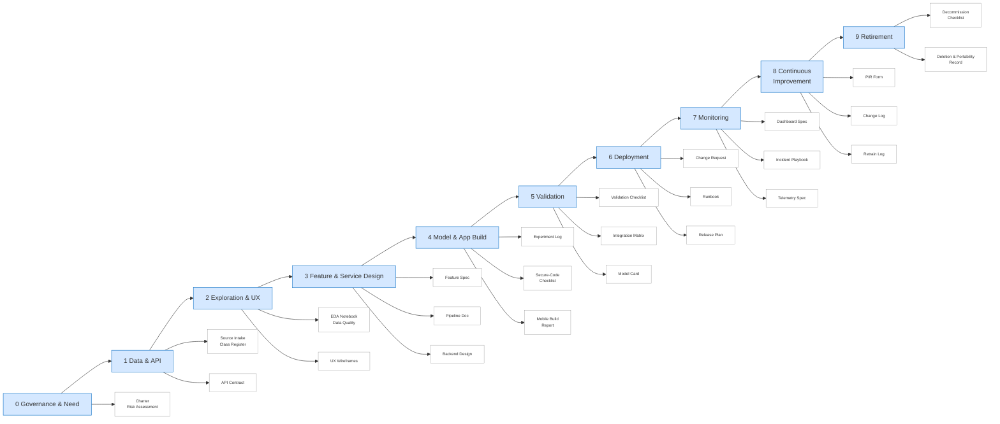

# AI/ML Lifecycle – Executive Methodology Summary

This document condenses the **10‑phase methodology** (0–9) we developed—covering governance, data, modeling, mobile integration, deployment, monitoring, improvement, and retirement—into a single executive overview.

---

# ABSTRACT

Our AI/ML lifecycle guides an idea from initial business need through safe retirement by moving systematically across 10 phases (0-9):
0. governance, 
1. secure data intake and classification, 
2. exploratory analysis and UX design, 
3. feature and service architecture, 
4. model and mobile build with secure-coding controls, 
5. independent validation and end-to-end integration testing, 
6. CCB-approved deployment and staged release, 
7. real-time monitoring with incident playbooks and telemetry, 
8. continuous improvement driven by post-implementation reviews and change logs, and 
9. finally decommissioning with evidence of data portability and deletion. 

At every step the methodology embeds Rejuve’s SDLC, Change-Management, and Data-Classification policies: separation-of-duties, encryption in transit and at rest, OWASP-based secure coding, formal risk and bias assessments, customer communication protocols, and signed approvals. The result is a repeatable, transparent framework that delivers compliant, reliable, and ethically sound AI products while providing auditors a complete artefact trail from charter to archival.

## 1 Purpose

Deliver a **repeatable, policy‑compliant framework** for building, deploying, and retiring AI features inside a mobile application backed by AWS infrastructure, while satisfying Rejuve’s SDLC, Change‑Management, and Data‑Classification policies.

---

## 2 Phase Snapshot

|#|Phase|Key Goal|Exit Gate|
|---|---|---|---|
|0|Governance & Need|Charter + Risk Assessment|CEO + CTO approval|
|1|Data & API Definition|Secure data intake, API Contract v0.1|Security Officer OK + first ingestion run|
|2|Exploration & UX Wireframes|Data‑quality ≥ threshold; screen designs approved|Product + Security sign‑off|
|3|Feature / Service Design|Feature Spec + AWS backend design approved|CTO + Security review|
|4|Modeling & App Build|Models meet metrics; mobile build passes scans|Checklist signed; build ready for validation|
|5|Validation & Integration Test|Independent QA passes; Model Card published|All validation tests green|
|6|Deployment & Release|CCB‑approved rollout & monitoring|Post‑deploy KPIs within limits|
|7|Monitoring & Telemetry|Dashboards live; on‑call playbook tested|Metrics + alerts operational|
|8|Continuous Improvement|PIR complete; Change‑Log + retrain log active|Action items assigned|
|9|Retirement & Archival|Data exported/deleted; infra torn down|Final approvals & audit pack stored|

---

## 3 Cross‑Phase Governance

- **Templates** – 45+ Markdown/Sheets templates covering every artefact (Charter, Model Card, Decommission, etc.).
    
- **Policy Hooks** – Each phase maps directly to SDLC, Change‑Mgmt, and Data‑Classification controls.
    
- **Roles Matrix** – Clear RACI for CEO → Mobile QA Lead, embedding separation‑of‑duties.
    

---

## 4 Mermaid Visuals

### 4.1 Flowchart (Phases 0→9)

```mermaid
flowchart LR
    P0[0 Governance] --> P1[1 Data & API]
    P1 --> P2[2 Explore & UX]
    P2 --> P3[3 Feature & Service Design]
    P3 --> P4[4 Model & App Build]
    P4 --> P5[5 Validation]
    P5 --> P6[6 Deploy & Release]
    P6 --> P7[7 Monitoring]
    P7 --> P8[8 Continuous Improve]
    P8 --> P9[9 Retirement]
```

### 4.2 Sequence Diagram (Key Actors per Release)

### 4.3 Mindmap (Deliverables per Phase)

---

## 5 Outcome & Next Steps

The methodology now provides a **single, end‑to‑end playbook**—templates, roles, gates, and visual maps—to bring any future AI feature from concept to retirement with full compliance and traceability.  
_For the next project, copy the template suite, update the Charter, and progress phase‑by‑phase, ensuring each gate criteria are met before moving forward._