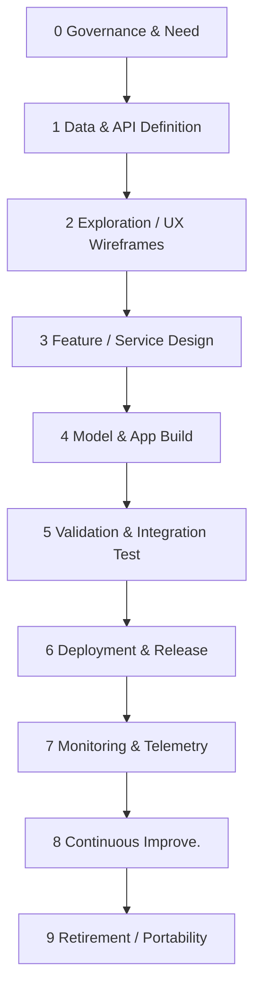
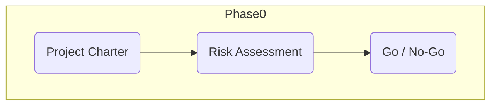
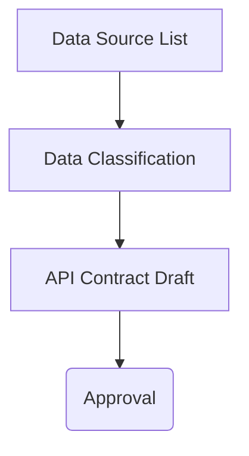
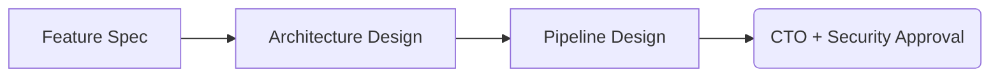
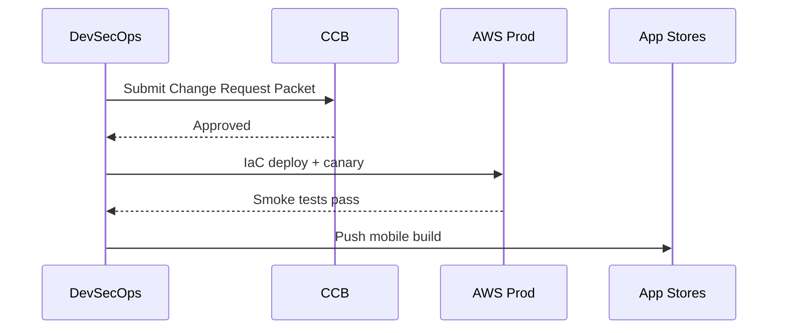

Below is a **complete, phase-by-phase methodology** that unifies

- the ML / model workflow
- the mobile-app + AWS integration workflow
- every mandatory control in your **SDLC Policy**, **Change-Management Policy**, and **Data-Classification Policy**.
    

An **overview mermaid diagram** comes first; then each phase (0-9, total of 10 phases) is documented in the same structure:

> **Purpose · Prerequisites · Roles · Tech Focus · Detailed Steps · Gate / Approval · Templates · Mandatory Policy Hooks**

---

---

## Phase 0 – Governance & Determine System Need

| **Phase Element**    | **Details**                                                                                                                                                                          |
| :------------------- | :----------------------------------------------------------------------------------------------------------------------------------------------------------------------------------- |
| **Purpose**          | Align business/clinical objective, secure funding, set risk appetite, and assign accountable roles.                                                                                  |
| **Prerequisites**    | High-level business case; preliminary user/clinical problem statement.                                                                                                               |
| **Roles**            | CEO ✓ (sign-off) · CTO ✓ · Security Officer ✓ (risk lens) · Product Mgr ✓ · Project Mgr ●                                                                                            |
| **Technology Focus** | None yet—focus is on strategy, budgeting, compliance posture.                                                                                                                        |
| **What Happens**     | 1) Draft **Project Charter** · 2) Perform **Security & Privacy Risk Assessment** (threats, HIPAA/GDPR scope) · 3) Build **Stakeholder / RACI** matrix · 4) Estimate ROI & resources. |
| **Gate / Approval**  | CEO & CTO countersign Charter; Security Officer approves initial risk rating.                                                                                                        |
| **Core Templates**   | • Project Charter (0.1) • RACI Matrix (0.2) • Security & Privacy Risk Assessment (0.3)                                                                                                               |
| **SDLC Must-Have**   | *Determine System Need* phase defined; risk assessment documented.                                                                                                                   |
| **Change-Mgmt Req**  | None (project not yet under change control).                                                                                                                                         |
| **Data-Class Req**   | Identify anticipated data categories (Restricted / Confidential) in Charter.                                                                                                         |

---

## Phase 1 – Data & API Definition (Data Ingestion ✚ API Contract)

| **Phase Element**    | **Details**                                                                                                                                                                                                 |
| :------------------- | :---------------------------------------------------------------------------------------------------------------------------------------------------------------------------------------------------------- |
| **Purpose**          | Secure data sources **and** draft the mobile/backend **API Contract** (OpenAPI/GraphQL).                                                                                                                    |
| **Prerequisites**    | Approved Charter & Risk Assessment.                                                                                                                                                                         |
| **Roles**            | Security Officer ✓ · Product Mgr ✓ · Backend API Eng ✓ · Mobile Dev Lead ● · Data Scientist ●                                                                                                               |
| **Technology Focus** | S3 landing bucket, AWS Glue catalog, OpenAPI YAML / GraphQL SDL.                                                                                                                                            |
| **What Happens**     | 1) List data sources & sign any DUAs/IRB docs 2) Populate **Data Classification Register** 3) Draft **API Contract** (end-points, auth, error codes) 4) Plan encryption & tokenisation for Restricted data. |
| **Gate / Approval**  | Security Officer approves data labels & de-identification plan; Product Mgr approves API schema.                                                                                                            |
| **Core Templates**   | • Data Source Intake (1.1) • Data Classification Register (1.2) • API Contract (YAML stub) (1.3) • Ingestion Run Log (1.4)                                                                                                        |
| **SDLC Must-Have**   | *Define System Requirements* → security requirements captured in API spec.                                                                                                                                  |
| **Change-Mgmt Req**  | Ingestion scripts and API stub tracked in Jira but not yet deployed (planning ticket).                                                                                                                      |
| **Data-Class Req**   | Register holds classification, encryption-in-transit flag, NDA flag.                                                                                                                                        |

---

## Phase 2 – Exploration & UX Wireframes

| **Phase Element**    | **Details**                                                                                                                                                          |
| :------------------- | :------------------------------------------------------------------------------------------------------------------------------------------------------------------- |
| **Purpose**          | Understand data quality/bias **and** prototype app wireframes showing how the model output will surface to users.                                                    |
| **Prerequisites**    | Data landed & classified; API stub available.                                                                                                                        |
| **Roles**            | Data Scientist ✓ · Mobile UX Designer ✓ · QA Lead ● · Security Officer ●                                                                                             |
| **Technology Focus** | Jupyter / Pandas or SageMaker Studio for EDA; Figma or Miro for wireframes.                                                                                          |
| **What Happens**     | 1) Run EDA notebook (includes handling checklist banner) 2) Produce Data Quality Scorecard 3) Draft mobile screens & consent copy 4) Validate user-input edge cases. |
| **Gate / Approval**  | Product Mgr signs off wireframes; Security Officer signs Data Quality ≥ threshold.                                                                                   |
| **Core Templates**   | • EDA Notebook Header (2.1) • Data-Quality Checklist (2.2) • UX Wireframe PDF/Link (2.3)                                                                                               |
| **SDLC Must-Have**   | Early *Design System Components*—interface, data constraints, consent language.                                                                                      |
| **Change-Mgmt Req**  | Jira ticket links EDA results & wireframes; no prod impact yet.                                                                                                      |
| **Data-Class Req**   | EDA notebook forbids saving Restricted rows locally (checklist item).                                                                                                |

---

## Phase 3 – Feature / Service Design

| **Phase Element**    | **Details**                                                                                                                                                      |
| :------------------- | :--------------------------------------------------------------------------------------------------------------------------------------------------------------- |
| **Purpose**          | Define the feature set, service architecture, and both model + API integration approach.                                                                         |
| **Prerequisites**    | Approved wireframes and data quality scorecard.                                                                                                                    |
| **Roles**            | Data Scientist ✓ · Backend API Eng ✓ · Mobile Dev Lead ✓ · Security Officer ● · Product Mgr ●                                                                       |
| **Technology Focus** | AWS CDK/CloudFormation for backend, API Gateway, Lambda, native mobile components; GitHub for design docs.                                                      |
| **What Happens**     | 1) Draft **Feature Specification** · 2) Design pipeline & backend architecture · 3) Define model inference rules · 4) Mock up API responses and errors.            |
| **Gate / Approval**  | CTO signs off on architecture; Security Officer validates design meets threat model.                                                                               |
| **Core Templates**   | • Feature Specification (3.1) • Pipeline Design (3.2) • Backend Architecture (3.3)                                                                                                |
| **SDLC Must-Have**   | *Design System Components* phase requires system-level architecture with security controls.                                                                   |
| **Change-Mgmt Req**  | Design docs tracked in GitHub; ticket references all design artifacts.                                                                                            |
| **Data-Class Req**   | Architecture ensures data classification controls persist across system.                                                                                         |

---

## Phase 4 – Model & App Build

| **Phase Element** | **Details**                                                                                                                        |
| :------------------ | :-------------------------------------------------------------------------------------------------------------------------------- |
| **Purpose**         | Train candidate models **and** build the mobile app (unit tests, static analysis).                                                |
| **Prerequisites**   | Approved feature set & service design.                                                                                           |
| **Roles**           | Data Scientist ✓ · Developers (iOS/Android) ✓ · QA Lead ● · Security Officer ✓ (secure-code)                                     |
| **Technology Focus**| MLflow / SageMaker Experiments; GitHub Actions, CodeBuild, Swift/Kotlin, ESLint; OWASP ZAP / MobSF scanners.                     |
| **What Happens**    | 1) Fill **Experiment Design & Log** 2) Perform **Secure-Coding & Threat-Model Checklist** (OWASP Top-10, mobile attack-surface) 3) Static & unit tests run in CI; artifacts stored in CodeArtifact / S3. |
| **Gate / Approval** | Top-N models meet metric targets; Security Officer signs secure-coding checklist; QA passes unit test coverage %.                  |
| **Core Templates**  | • Experiment Design & Log (4.1) • Secure-Coding & Threat-Model Checklist (4.2) • Mobile Build Report (4.3)                                                             |
| **SDLC Must-Have**  | *Build System Components* phase demands proof of code reviews & vulnerability scans.                                            |
| **Change-Mgmt Req** | All commits via pull requests with branch protection; ticket ID referenced in commit message.                                      |
| **Data-Class Req**  | Training logs avoid storing raw Restricted data (only IDs / embeddings).                                                       |

---

## Phase 5 – Validation & Integration Test

| **Phase Element** | **Details**                                                                                                                               |
| :------------------ | :--------------------------------------------------------------------------------------------------------------------------------------- |
| **Purpose**         | Confirm model performance, fairness, privacy, and that the **mobile → API → model** round-trip behaves as designed.                       |
| **Prerequisites**   | Built app binary; packaged model & APIs in staging.                                                                                      |
| **Roles**           | QA/Test Lead ✓ · Security Officer ✓ · Mobile QA Automation ✓ · Data Scientist ●                                                           |
| **Technology Focus**| Appium / Detox / Espresso for UI tests; Postman collections; Fairness & bias tools (Aequitas, Google WIT); AWS Device Farm optional.       |
| **What Happens**    | 1) Run **Validation Checklist** (perf, bias, privacy) 2) Execute **Integration Test Matrix** via automation 3) Compile **Model Card**. |
| **Gate / Approval** | Validation Report signed by QA Lead + Security Officer; Model Card published to internal registry.                                         |
| **Core Templates**  | • Validation Checklist (5.1) • Integration Test Matrix (5.2) • Model Card (5.3)                                                                           |
| **SDLC Must-Have**  | *Evaluate System Readiness*—independent testers validate acceptance criteria & security.                                                 |
| **Change-Mgmt Req** | Test evidence attached to Change Request Packet awaiting CCB.                                                                             |
| **Data-Class Req**  | Test datasets de-identified; telemetry events labelled before run.                                                                        |

---

## Phase 6 – Deployment & Release

| **Phase Element** | **Details**                                                                                                                                      |
| :------------------ | :--------------------------------------------------------------------------------------------------------------------------------------------- |
| **Purpose**         | Deploy model (Lambda/ECS) and backend, release mobile app via TestFlight / Google Play staged rollout; enforce full change-control process. |
| **Prerequisites**   | Signed Validation Report & Change Request Packet.                                                                                              |
| **Roles**           | DevSecOps Eng ✓ · CCB (CTO chair) ✓ · Mobile Dev Lead ✓ · System Admins ● · QA Lead ●                                                          |
| **Technology Focus**| AWS CodePipeline, EKS/Lambda, CloudFormation/CDK, Cognito; App Store Connect & Google Play Console; Feature flags (AppConfig).                    |
| **What Happens**    | 1) Populate **Change Request Packet** (impact, ROI, rollback, customer notice draft) 2) CCB meeting & approval 3) Deploy via IaC pipeline 4) Shift traffic with Lambda aliases / canary 5) Publish app to β-track then prod. |
| **Gate / Approval** | CCB approval logged; smoke tests green in prod; 30-day notice sent if infra change affects customers.                                            |
| **Core Templates**  | • Change Request Packet (6.1) • Deployment Runbook (6.2) • Release & Rollback Plan (6.3)                                                                        |
| **SDLC Must-Have**  | *System Deployment Phase* outlines training & user documentation.                                                                                |
| **Change-Mgmt Req** | All bullet-points from policy: human approval, rollback plan, audit log, separation-of-duties.                                                  |
| **Data-Class Req**  | Production IAM roles enforce data-class controls (encryption, access).                                                                         |

---

## Phase 7 – Monitoring & Telemetry

| **Phase Element** | **Details**                                                                                                                               |
| :------------------ | :-------------------------------------------------------------------------------------------------------------------------------------- |
| **Purpose**         | Observe model drift & latency **and** mobile crash/UX metrics; detect security incidents.                                                |
| **Prerequisites**   | Prod deployment live.                                                                                                                   |
| **Roles**           | DevSecOps ✓ · Mobile QA Automation ✓ · Security Officer ✓ · Data Scientist ●                                                             |
| **Technology Focus**| AWS CloudWatch, Prometheus/Grafana, Pinpoint, Sentry, Cognito logs; SageMaker Model Monitor optional.                                   |
| **What Happens**    | 1) Implement dashboards: latency, drift, crash-free sessions, PHI access alerts 2) Monthly KPI review with CTO & Security.                |
| **Gate / Approval** | Monthly KPI & incident report signed by CTO + Security Officer.                                                                        |
| **Core Templates**  | • Monitoring Dashboard (7.1) • Incident Response Playbook (7.2) • Mobile Telemetry Spec (7.3)                                                             |
| **SDLC Must-Have**  | *Operations & Maintenance* implied in policy.                                                                                             |
| **Change-Mgmt Req** | Incidents that trigger code changes open new Jira tickets.                                                                                |
| **Data-Class Req**  | Telemetry event spec flags Restricted fields and applies encryption at rest.                                                            |

---

## Phase 8 – Continuous Improvement

| **Phase Element** | **Details**                                                                                                                                 |
| :------------------ | :---------------------------------------------------------------------------------------------------------------------------------------- |
| **Purpose**         | Analyze monitoring signals, run post-implementation review, queue new model retraining and app feature tickets.                         |
| **Prerequisites**   | KPI report; drift or feature-request signals.                                                                                             |
| **Roles**           | Product Mgr ✓ · CCB ✓ · Project Mgr ✓ · Data Scientist ● · Dev & Mobile Teams ●                                                          |
| **Technology Focus**| Jira automations for PIR tasks; SageMaker Pipelines for scheduled retraining; LaunchDarkly/AppConfig for feature flags.                   |
| **What Happens**    | 1) Conduct **Post-Implementation Review** 2) Decide retrain vs code change 3) File new Change Requests.                                   |
| **Gate / Approval** | PIR signed; new Change Requests entered & prioritized.                                                                                   |
| **Core Templates**  | • Post-Implementation Review (8.1) • Change-Log (8.2) • Retrain Log (8.3)                                                                                                  |
| **SDLC Must-Have**  | Feeds back into new *Determine Need* cycles.                                                                                                |
| **Change-Mgmt Req** | Every remedial or enhancement item restarts the CCB pipeline.                                                                              |
| **Data-Class Req**  | Any new data collected routed through Phase 1 classification first.                                                                       |

---

## Phase 9 – Retirement / Portability

| **Phase Element** | **Details**                                                                                                                                          |
| :------------------ | :------------------------------------------------------------------------------------------------------------------------------------------------- |
| **Purpose**         | Decommission the model & related APIs, remove app from stores, fulfil data-portability & deletion promises.                                         |
| **Prerequisites**   | Decision to retire; successor solution in place.                                                                                                   |
| **Roles**           | CTO ✓ · Security Officer ✓ · DevSecOps Eng ✓ · Legal/Compliance ●                                                                               |
| **Technology Focus**| S3 Glacier / AWS Backup for archives; Store Connect & Play Console de-listing; scripted data export in defined formats (Parquet/JSON).             |
| **What Happens**    | 1) Generate **Data Deletion & Portability Record** 2) Archive artifacts & model card 3) Remove app & APIs, revoke credentials 4) Confirm deletion to customers. |
| **Gate / Approval** | CTO & Security Officer confirm archival + deletion; customer acknowledgements stored.                                                               |
| **Core Templates**  | • Data Deletion & Portability Record (9.1) • Decommission Checklist (9.2) • Engineer Handover Template (9.3)                                                                                      |
| **SDLC Must-Have**  | *System Deployment* final step (retirement) documented.                                                                                             |
| **Change-Mgmt Req** | Final Change ticket closes release; audit trail kept 7 yrs (policy).                                                                                  |
| **Data-Class Req**  | Proof that Restricted data wiped or anonymised; retention schedule met.                                                                             |
---

### How to use this document

1. **Copy each Core Template** section into Markdown or Google Sheets as you start a phase.
2. **Link templates to Jira / ClickUp** tickets so gates are auditable.
3. **Mermaid flows** can be embedded in Confluence or GitHub README for visual status.
4. During execution, the **Policy hooks** table cells act as your internal audit checklist.

### Role Symbols Legend
- ✓ = Primary responsibility (must participate)
- ● = Supporting/advisory role (consult as needed)

### Data Classification Definitions
- **Restricted**: Highly sensitive data requiring maximum security controls (PHI, PII)
- **Confidential**: Business-sensitive data requiring standard security controls
- **Internal**: Non-sensitive operational data with basic access controls
- **Public**: Data approved for public distribution with no special controls

---