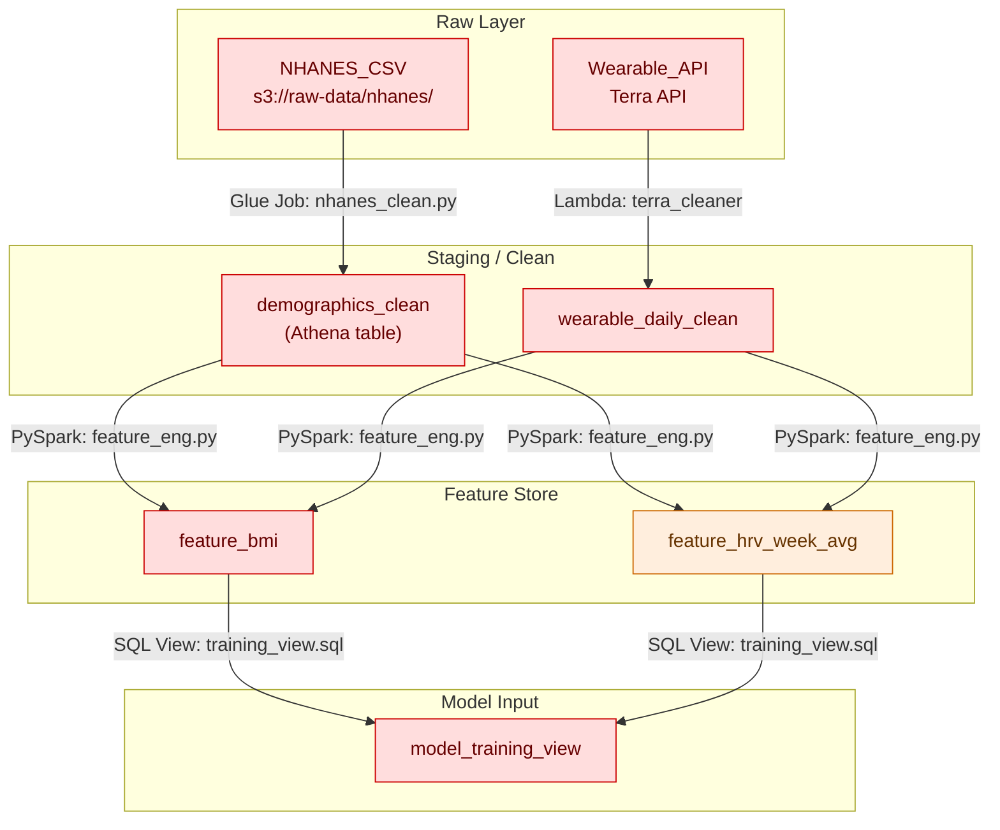

### Template **3.2 – Transformation Pipeline Doc**

_(Phase 3 – Feature / Service Design)_

This deliverable has **two parts**:

1. **Mermaid flow diagram skeleton** – paste into a `README.md`, Confluence, or any Mermaid-enabled viewer.
2. **Step-by-step pipeline table** – copy into **Google Sheets** (_File → Import → “Paste data”_) for detailed tracking / change control.
    

---

#### 3.2-A Mermaid Flow Skeleton

> **Legend:**  
> 🟥 **Restricted** – PHI/PII; must stay encrypted and access-controlled.  
> 🟧 **Confidential** – derived metrics; still sensitive.

---

#### 3.2-B Transformation Pipeline Table (Google Sheets-ready)

|**Field**|**Description / Allowed Values**|**Example**|
|---|---|---|
|**Step ID**|Unique slug|`step_nhanes_clean`|
|**Order**|Pipeline order (1 … N)|1|
|**Source Asset ID(s)**|From Data Classification Register|`nhanes_demo_2017_20`|
|**Source Classification**|Restricted · Confidential · …|Restricted|
|**Tool / Runtime**|_Glue ETL, PySpark, Lambda, SQL, Pandas_|Glue Job|
|**Script / IaC Path**|Repo path to code / Terraform module|`etl/nhanes_clean.py`|
|**Output Dataset / Table**|Name & destination (S3, Athena, Redshift)|`demographics_clean` (Athena)|
|**Output Classification**|Inherits or downgrades?|Restricted|
|**Schedule / Trigger**|Cron, event, manual|`cron(0 2 * * ? *)` (daily @ 02:00 UTC)|
|**Data-Quality Assertions**|# tests executed (Great Expectations, Deequ…)|12 tests – **all pass**|
|**Encryption Verified**|Yes / No|Yes|
|**Separation-of-Duties**|Runner ≠ approver?|Yes|
|**Change Ticket ID**|Jira / PR link|`ETL-101`|
|**Owner**|Name & email|[hassan.iqbal@rejuve.ai](mailto:hassan.iqbal@rejuve.ai)|
|**Last Run Status**|Success · Failed · Warn|Success|
|**Notes**|Free text|Cast `RIDSTATR` to bool; remove 12 dup rows|

> **Usage Tips**

- **Version control** – Every script path **must** originate from a PR; link its ID in “Change Ticket ID.”
- **Data classification** – If output level drops (e.g., Restricted → Confidential), note the de-identification step in _Notes_.
- **Automated checks** – Integrate Great Expectations/Deequ; store JSON results in the same S3 folder for auditors.

---

**Next template:** **3.3 – Backend Service Design** (AWS architecture & endpoint spec).  
