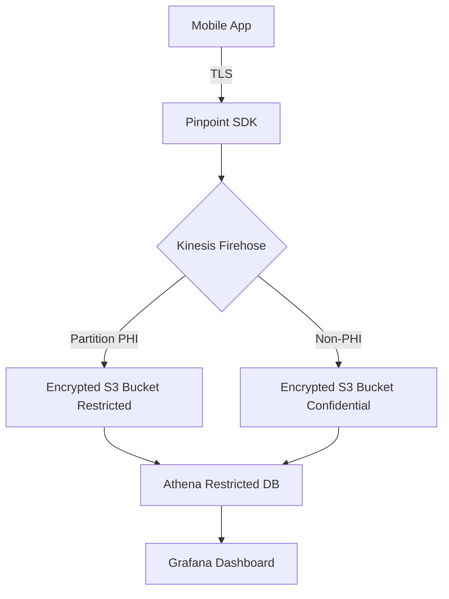

# Template 7.3 – Mobile Telemetry Spec

>It specifies:

- Complete event dictionary with classification, consent, retention
- Mermaid data-flow diagram for PHI vs non-PHI routing
- Privacy controls (consent modal, encryption, lifecycle, deletion)
- Review cadence and approval block

_Phase 7 – Monitoring & Telemetry_

> **Purpose**  
> Define all analytic and diagnostic events emitted by the mobile app, including data classification tags, consent requirements, and retention periods, to comply with privacy regulations and ensure observability.

---

## 1 Metadata

|Field|Description|Example|
|---|---|---|
|**Spec ID**|Unique key|`TEL-2025-06-07`|
|**Version**|SemVer|1.0.0|
|**Maintainer**|Name & email|[mobile@rejuve.ai](mailto:mobile@rejuve.ai)|
|**Last Updated**|yyyy-mm-dd|2025-06-07|

---

## 2 Event Dictionary

|**Event Name**|**Screen / Context**|**Description**|**Payload Schema (key:type)**|**Data Classification**|**PII/PHI?**|**Consent Required?**|**Retention Days**|
|---|---|---|---|---|---|---|---|
|`view_dashboard`|Dashboard|User opens dashboard|`seqn:string`, `timestamp:iso`, `bio_age:float`|Restricted|Yes|Yes (in-app consent)|365|
|`tap_insight_card`|Dashboard|User taps insight|`insight_id:string`, `timestamp`|Internal|No|No|730|
|`login_success`|Login Screen|Successful login|`user_id:string`, `method:string`|Confidential|Yes|Yes (privacy policy)|180|
|`share_result`|Share Dialog|User shares bio age|`channel:string`, `timestamp`|Confidential|May|Yes (opt‑in)|30|
|…|…|…|…|…|…|…|…|

> **Guidelines**  
> • **Data Classification** must map to Legend tab (Restricted, Confidential, Internal, Public).  
> • If `PII/PHI?` = Yes, encrypt event in transit (TLS) and at rest (KMS).  
> • `Consent Required?` column drives feature flag toggles at runtime.

---

## 3 Data Flow Diagram (Mermaid)

---

## 4 Privacy & Compliance Controls

|Control|Implementation|Evidence Path|
|---|---|---|
|In-app consent modal|React‑Native component `ConsentModal.tsx`|`ux/wireframe/consent_modal.png`|
|Event encryption|Pinpoint HTTPS + SSE-KMS|AWS KMS CMK `arn:aws:kms:…`|
|Data retention|S3 lifecycle rule (days)|Terraform `s3_lifecycle.tf`|
|User deletion|GDPR delete lambda|`lambda/delete_user_data.py`|

---

## 5 Review & Update Process

|Frequency|Responsible|Task|
|---|---|---|
|Quarterly|Mobile Dev Lead|Audit event list vs new features|
|Before new feature GA|Product Manager|Update consent strings & legend|

---

## 6 Approvals

|Role|Name|Date|Signature|
|---|---|---|---|
|**Security Officer**||||
|**Product Manager**||||
|**Mobile QA Lead**||||

> **Pass Criteria**  
> • All events classified and consent flags set.  
> • Mermaid data-flow diagram reviewed by Security.  
> • S3 lifecycle & deletion functions deployed.