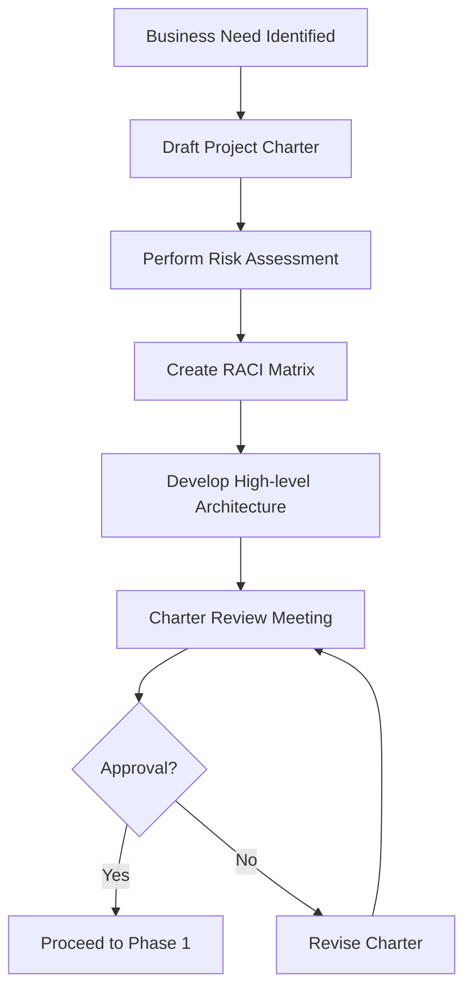

# Phase 0: Governance & Determine System Need

## Purpose & Objectives

Phase 0 establishes the foundational elements of any AI/ML and application development project. It focuses on aligning business or clinical objectives with technical possibilities, securing appropriate funding, setting risk tolerance parameters, and assigning accountable roles. This phase answers the critical question: "Should we build this system, and if so, how will we govern it?"

## Key Activities

### 1. Business Case Development

- Articulate the business problem or clinical need
- Quantify potential ROI or clinical impact
- Identify primary stakeholders and user groups
- Establish preliminary timeline and budget estimates
- Document any regulatory or compliance constraints

### 2. Risk Assessment & Classification

- Perform initial threat modeling
- Identify data protection requirements (HIPAA, GDPR, etc.)
- Categorize anticipated data types (Restricted, Confidential, etc.)
- Assess regulatory impact and compliance requirements
- Document risk mitigation strategies

### 3. Role & Responsibility Assignment

- Create comprehensive RACI matrix
- Define escalation paths for key decisions
- Identify required skill sets and resource gaps
- Establish project governance structure
- Define communication protocols

### 4. Preliminary Architecture Outline

- Document high-level system components
- Identify integration points with existing systems
- Note potential technology constraints
- Outline security architecture requirements
- Consider scalability and performance needs

## Roles & Responsibilities

| **Role**          | **Responsibility**                                                     | **Participation Level** |
|-------------------|-----------------------------------------------------------------------|-------------------------|
| CEO               | Final charter approval, resource allocation confirmation              | Sign-off required       |
| CTO               | Technical feasibility assessment, technology direction                | Active participation    |
| Security Officer  | Risk assessment, compliance framework definition                      | Active participation    |
| Product Manager   | Business case articulation, stakeholder management                    | Active participation    |
| Project Manager   | Planning, resource coordination, timeline development                 | Advisory/support        |

## Technology Focus

The technology focus in Phase 0 is minimal, primarily centered on strategy, budgeting, and compliance positioning. However, preliminary discussions may include:

- Potential AI/ML approaches
- Cloud vs. on-premises considerations
- High-level data storage and processing requirements
- Possible API and integration strategies
- Security and compliance technologies

## Deliverables & Templates

### 1. Project Charter (0.1)
A comprehensive document outlining the project's purpose, scope, objectives, stakeholders, preliminary timeline, budget, and success criteria.

### 2. RACI Matrix (0.2)
A detailed responsibility assignment matrix showing who is Responsible, Accountable, Consulted, and Informed for each major project activity.

### 3. Security & Privacy Risk Assessment (0.3)
Initial evaluation of security threats, privacy concerns, compliance requirements, and mitigation strategies.

### 4. Initial Product Backlog
High-level list of features and requirements to guide subsequent planning phases.

### 5. Compliance Plan
Documentation of relevant regulations and standards with planned approach for adherence.

### 6. High-level Architecture Outline
Conceptual diagram of system components and their interactions.

## Entry & Exit Criteria

### Entry Criteria:
- High-level business case or concept
- Preliminary user or clinical problem statement
- Executive sponsorship

### Exit Criteria:
- CEO and CTO signature on Project Charter
- Security Officer approval of initial risk rating
- Completed RACI matrix
- Approved initial budget allocation

## Policy Compliance Hooks

### SDLC Policy Requirements
This phase fulfills the "Determine System Need" requirements in the SDLC policy by documenting the business need and establishing a risk assessment baseline.

### Change Management Requirements
As the project is not yet under change control, formal change management processes don't apply. However, the Charter establishes the baseline against which future changes will be measured.

### Data Classification Requirements
The Charter must identify anticipated data categories (Restricted/Confidential) that the system will process, store, or transmit.

## Best Practices & Tips

- **Executive Engagement**: Ensure C-level engagement early to prevent approval delays later
- **Right-Size Documentation**: Scale documentation depth to project size and risk profile
- **Think Ahead**: Consider how Phase 0 decisions impact later phases
- **Compliance First**: Identify regulatory requirements early to avoid costly rework
- **Clear Communication**: Ensure all stakeholders understand project parameters
- **Feasibility Check**: Validate that technical capabilities exist to meet business objectives

## Common Pitfalls

- Superficial risk assessment leading to compliance issues
- Unclear roles and responsibilities causing decision bottlenecks
- Underestimated budget and timeline creating unrealistic expectations
- Failure to identify all required data sources and their classification
- Insufficient executive sponsorship to secure needed resources

---

## Phase 0 Workflow

