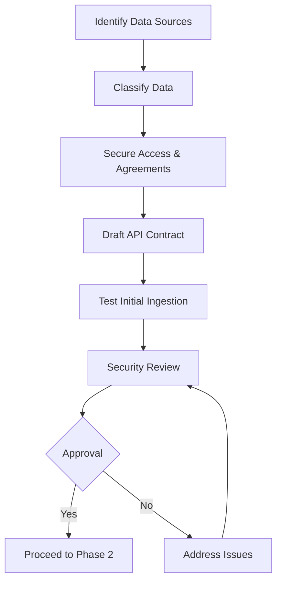

# Phase 1: Data & API Definition

## Purpose & Objectives

Phase 1 establishes the foundation for both data science and application development workflows. It focuses on securing and understanding data sources, drafting API contracts that will connect front-end applications with back-end services and ML models, and ensuring data compliance. This phase answers the critical questions: "What data will power our models?" and "How will our applications communicate with our services?"

## Key Activities

### 1. Data Source Identification & Acquisition

- Inventory all required data sources
- Secure access credentials and permissions
- Sign data usage agreements (DUAs) or IRB approvals
- Document data lineage and provenance
- Establish data refresh/update frequency

### 2. Data Classification & Security

- Classify all data according to sensitivity (Restricted, Confidential, Internal, Public)
- Document encryption requirements for data at rest and in transit
- Establish de-identification or tokenization strategies for sensitive data
- Define data access controls and audit requirements
- Ensure compliance with relevant regulations (HIPAA, GDPR, etc.)

### 3. API Contract Definition

- Define API endpoints, methods, and authentication requirements
- Document request/response formats and error codes
- Establish rate limiting and security controls
- Create OpenAPI/Swagger specifications
- Define versioning strategy

### 4. Initial Data Ingestion

- Create and test data loading scripts
- Validate data quality and completeness
- Establish data catalog entries
- Document any data quality issues or gaps
- Set up automated ingestion pipelines where applicable

## Roles & Responsibilities

| **Role**           | **Responsibility**                                           | **Participation Level** |
|--------------------|-------------------------------------------------------------|-------------------------|
| Security Officer   | Data classification approval, security controls validation   | Active participation    |
| Product Manager    | API requirements definition, business data needs            | Active participation    |
| Backend API Engineer| API contract development, endpoint design                  | Active participation    |
| Mobile Dev Lead    | API consumption requirements, mobile constraints            | Advisory/support        |
| Data Scientist     | Data quality assessment, feature identification             | Advisory/support        |

## Technology Focus

- S3 or equivalent data lake/landing zones
- AWS Glue or similar data catalog services
- OpenAPI/Swagger for API documentation
- GraphQL schema definition language (SDL) where applicable
- ETL/ELT tools for data ingestion
- Data encryption and tokenization technologies
- Authentication services (OAuth, JWT, etc.)

## Deliverables & Templates

### 1. Data Source Intake (1.1)
Documentation of each data source including origin, format, volume, update frequency, and access methods.

### 2. Data Classification Register (1.2)
Comprehensive register of all data elements with classification levels, encryption requirements, and compliance considerations.

### 3. DUA / IRB Consent Tracker
Log of all data usage agreements and IRB approvals with status, expiration dates, and conditions.

### 4. Ingestion Run Log (1.4)
Record of data ingestion jobs, success/failure status, data quality metrics, and issues encountered.

### 5. API Contract (YAML/OpenAPI) (1.3)
Formal API specification in YAML/JSON format following OpenAPI standards, defining all endpoints, methods, parameters, responses, and authentication.

## Entry & Exit Criteria

### Entry Criteria:
- Approved Project Charter
- Completed Risk Assessment
- Identified data needs from business requirements

### Exit Criteria:
- Security Officer approval of data classification and de-identification plans
- Product Manager approval of API schema
- Successful initial data ingestion
- API contract draft reviewed and approved

## Policy Compliance Hooks

### SDLC Policy Requirements
This phase fulfills the "Define System Requirements" section of the SDLC policy by documenting API requirements and security considerations.

### Change Management Requirements
Ingestion scripts and API contracts are tracked in work items (Jira/ClickUp) but not yet deployed to production environments.

### Data Classification Requirements
The Data Classification Register documents security classifications, encryption requirements, and NDA/DUA status for all data elements.

## Best Practices & Tips

- **API First**: Design APIs before implementing to ensure all teams have a clear contract
- **Classification Precision**: Be specific about data classification to avoid over/under protecting
- **Early Testing**: Test data ingestion with small samples before full loads
- **Documentation**: Keep API documentation in source control alongside code
- **Version Planning**: Consider API versioning strategy from the beginning
- **Security Validation**: Have security team review API authentication early

## Common Pitfalls

- Incomplete data classification leading to security vulnerabilities
- API contracts that change frequently causing integration issues
- Data quality issues discovered too late in the process
- Missing data usage agreements creating legal/compliance risk
- Insufficient error handling in API specifications
- Lack of attention to rate limiting and performance considerations

---

## Phase 1 Workflow

