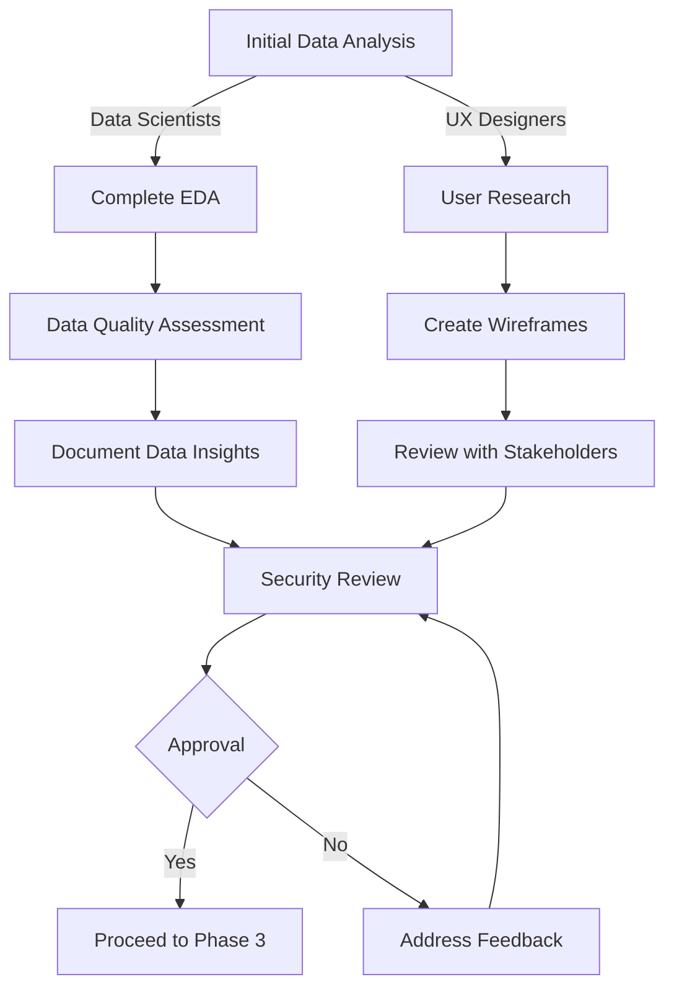

# Phase 2: Exploration & UX Wireframes

## Purpose & Objectives

Phase 2 represents the first deep dive into both data understanding and user experience design. This dual focus allows data scientists to assess data quality and potential biases while UX designers conceptualize how model insights will be presented to users. The phase bridges the gap between raw data and user-facing applications, ensuring both are aligned with business objectives and compliance requirements.

## Key Activities

### 1. Exploratory Data Analysis (EDA)

- Analyze data distributions, correlations, and patterns
- Identify missing values, outliers, and anomalies
- Assess data quality and completeness
- Detect potential biases in training data
- Document data insights and limitations

### 2. UX Research & Wireframing

- Conduct user research to understand needs and workflows
- Create user personas and journey maps
- Develop low-fidelity wireframes showing key screens
- Design error states and edge cases
- Incorporate accessibility requirements

### 3. Security & Privacy Considerations

- Review data handling in UX flows
- Design appropriate consent mechanisms
- Document user data collection points
- Assess privacy impact of proposed features
- Ensure compliance with regulatory requirements

### 4. Quality Assessment & Validation

- Establish data quality metrics and thresholds
- Validate user input edge cases
- Document necessary data transformations
- Assess representativeness of training data
- Identify supplementary data needs

## Roles & Responsibilities

| **Role**           | **Responsibility**                                       | **Participation Level** |
|--------------------|----------------------------------------------------------|-------------------------|
| Data Scientist     | Data analysis, quality assessment, bias detection        | Active participation    |
| Mobile UX Designer | User research, wireframe creation, interaction design    | Active participation    |
| QA Lead           | Edge case identification, validation criteria            | Advisory/support        |
| Security Officer  | Privacy assessment, consent mechanism validation         | Advisory/support        |

## Technology Focus

- Jupyter notebooks or SageMaker Studio for EDA
- Pandas, NumPy, and visualization libraries
- Figma, Sketch, or Adobe XD for wireframes
- Miro or similar for user journeys and flows
- Data quality assessment tools
- Fairness and bias detection libraries

## Deliverables & Templates

### 1. EDA Notebook Header (2.1)
Standardized Jupyter notebook with data exploration, quality checks, and handling guidelines for sensitive data.

### 2. Data-Quality Checklist (2.2)
Assessment of data completeness, accuracy, consistency, and timeliness with metrics and thresholds.

### 3. UX Wireframe Pack Checklist
Verification that wireframes address all requirements, user flows, error states, and edge cases.

### 4. UX Wireframe Pack (Figma/Miro/PDF) (2.3)
Complete set of wireframes showing application screens, user flows, and interaction patterns.

### 5. Data Protection Impact Assessment (DPIA)
Analysis of how user data will be collected, processed, and protected throughout the application.

## Entry & Exit Criteria

### Entry Criteria:
- Data sources identified and classified
- Initial data ingestion completed
- API contract draft available
- User requirements documented

### Exit Criteria:
- Product Manager approval of wireframes
- Security Officer sign-off on data quality meeting thresholds
- Completed EDA with documented insights
- DPIA reviewed and approved

## Policy Compliance Hooks

### SDLC Policy Requirements
This phase fulfills early "Design System Components" requirements by documenting interface concepts, data constraints, and consent language.

### Change Management Requirements
Work items track EDA results and wireframes, though no production impact exists at this stage.

### Data Classification Requirements
EDA notebooks must include checks preventing saving of Restricted rows locally, and wireframes must reflect appropriate handling of classified data.

## Best Practices & Tips

- **Show Don't Tell**: Use visualizations to communicate data insights clearly
- **Test Early**: Get wireframes in front of users early for feedback
- **Document Limitations**: Be honest about data quality issues and biases
- **Security by Design**: Consider privacy and security from the earliest wireframes
- **Multivariate EDA**: Examine relationships between variables, not just distributions
- **Accessibility First**: Design wireframes with accessibility in mind from the start

## Common Pitfalls

- Focusing only on "happy path" wireframes without considering edge cases
- Insufficient attention to data bias leading to unfair models
- Overlooking seasonality or time-dependencies in data
- Missing important user workflows in wireframe designs
- Inadequate consideration of mobile constraints in wireframes
- Failing to document data quality issues for later phases

---

## Phase 2 Workflow

