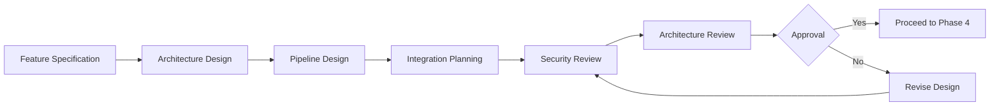

# Phase 3: Feature / Service Design

## Purpose & Objectives

Phase 3 focuses on detailed design of both features and technical architecture, bridging conceptual ideas from earlier phases into executable specifications. This phase creates the blueprint for all development work, ensuring that models, APIs, and user interfaces are coherently designed as an integrated system. The goal is to create detailed specifications and architectural designs that satisfy business requirements while maintaining security, scalability, and compliance.

## Key Activities

### 1. Feature Specification Development

- Define detailed functional and non-functional requirements
- Establish acceptance criteria for each feature
- Prioritize features into development phases
- Document user stories and use cases
- Define success metrics for features

### 2. Backend Architecture Design

- Design service architecture (microservices, serverless, etc.)
- Plan database schema and data access patterns
- Define infrastructure as code approach
- Document security controls and authentication flows
- Plan for scalability, resilience, and disaster recovery

### 3. AI/ML Pipeline Design

- Design model training and inference pipelines
- Plan for feature engineering and transformation steps
- Define model evaluation metrics and thresholds
- Document model versioning strategy
- Establish monitoring requirements for model performance

### 4. Integration Strategy

- Define service interfaces and contracts
- Document API error handling and retry strategies
- Plan for logging, monitoring, and observability
- Design caching and performance optimization strategies
- Establish testing strategy for integration points

## Roles & Responsibilities

| **Role**           | **Responsibility**                                          | **Participation Level** |
|--------------------|-------------------------------------------------------------|-------------------------|
| Data Scientist     | Model design, feature engineering pipeline design           | Active participation    |
| Backend API Engineer| Service architecture, API design, infrastructure planning   | Active participation    |
| Mobile Dev Lead    | Mobile architecture, integration planning                   | Active participation    |
| Security Officer   | Security review, threat modeling                           | Advisory/support        |
| Product Manager    | Feature prioritization, success criteria                    | Advisory/support        |

## Technology Focus

- AWS CDK or CloudFormation for infrastructure as code
- API Gateway, Lambda, and serverless technologies
- Mobile architecture frameworks (iOS/Android native)
- Model training and deployment frameworks
- Database design and optimization tools
- Authentication and authorization services

## Deliverables & Templates

### 1. Feature Spec Sheet (3.1)
Comprehensive documentation of all features including requirements, acceptance criteria, and success metrics.

### 2. Transformation Pipeline Document (3.2)
Detailed design of data transformation pipelines from raw data to model-ready features.

### 3. Backend Service Design (3.3)
Architecture diagrams and documentation for all backend services, databases, and infrastructure.

### 4. Software Architecture Document
Holistic view of the entire system architecture including all components, integration points, and data flows.

## Entry & Exit Criteria

### Entry Criteria:
- Approved wireframes and UX designs
- Data quality assessment completed
- Exploratory data analysis insights documented
- Initial API contract drafted

### Exit Criteria:
- CTO approval of system architecture
- Security Officer validation that design meets threat model requirements
- Complete feature specifications reviewed by product team
- Transformation pipeline design approved by data science team

## Policy Compliance Hooks

### SDLC Policy Requirements
This phase fulfills the "Design System Components" requirements by creating a comprehensive system-level architecture with appropriate security controls.

### Change Management Requirements
All design documents must be tracked in source control (GitHub) with proper versioning and references in work items.

### Data Classification Requirements
Architecture must ensure data classification controls persist across all components of the system, maintaining appropriate protections.

## Best Practices & Tips

- **Security First**: Incorporate security controls into architecture from the start
- **Future-Proof**: Design for flexibility and future feature additions
- **Document Decisions**: Capture architectural decisions and trade-offs
- **Standard Patterns**: Use established architectural patterns where possible
- **Observability**: Design monitoring and logging from the beginning
- **Review Early**: Conduct architecture reviews before implementation begins

## Common Pitfalls

- Overly complex architecture that's difficult to implement
- Insufficient attention to non-functional requirements
- Missing integration points between system components
- Incomplete error handling strategies
- Overlooking compliance requirements in the design
- Failing to consider operational aspects like deployment and monitoring

---

## Phase 3 Workflow

