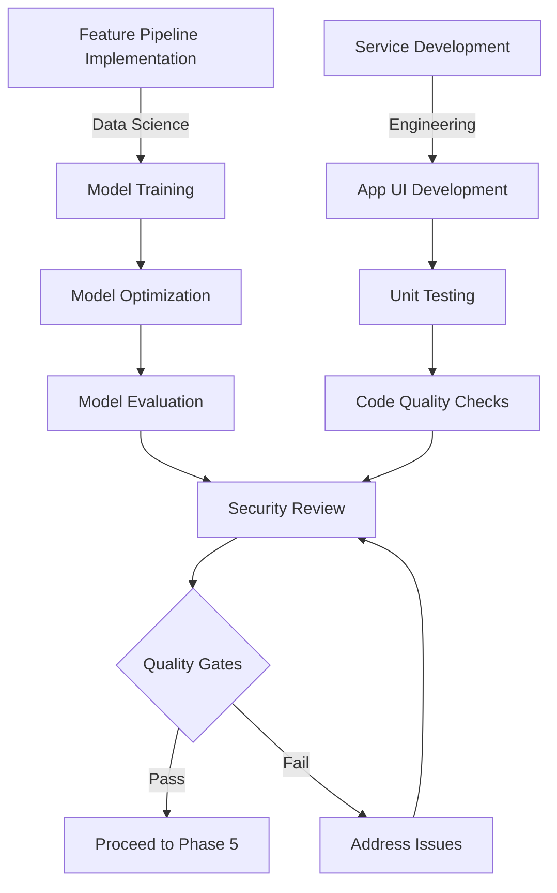

# Phase 4: Model & App Build

## Purpose & Objectives

Phase 4 moves from design to implementation, focusing on building both the AI/ML models and the application components. This phase transforms specifications into working code, creating the foundation for the entire system. The dual focus ensures that model development and application coding proceed in parallel, with coordinated integration points. The objectives are to develop models that meet performance metrics while building application components that comply with security standards and technical requirements.

## Key Activities

### 1. Model Training & Experimentation

- Implement feature engineering pipeline
- Train baseline and candidate models
- Log hyperparameters and results
- Evaluate models against defined metrics
- Document experiment results and insights
- Optimize best-performing models

### 2. Application Development

- Develop mobile application components (iOS/Android)
- Implement backend services and APIs
- Create authentication and authorization flows
- Build database schemas and data access layers
- Implement error handling and logging
- Create unit tests for all components

### 3. Security Implementation

- Follow secure coding practices (OWASP Top 10)
- Conduct threat modeling for critical components
- Implement data encryption and protection
- Set up authentication and authorization controls
- Integrate security libraries and tools
- Configure secure CI/CD pipelines

### 4. Testing & Quality Assurance

- Develop automated unit tests
- Implement CI/CD pipeline with quality gates
- Perform static code analysis
- Run security scans on code and dependencies
- Test model inference performance
- Verify compliance with coding standards

## Roles & Responsibilities

| **Role**           | **Responsibility**                                          | **Participation Level** |
|--------------------|-------------------------------------------------------------|-------------------------|
| Data Scientist     | Model training, experiment tracking, optimization           | Active participation    |
| Developers (iOS/Android) | Application coding, unit testing, UI implementation     | Active participation    |
| QA Lead            | Test strategy, quality metrics, automated testing           | Advisory/support        |
| Security Officer   | Secure coding review, vulnerability assessment              | Active participation    |

## Technology Focus

- MLflow, SageMaker Experiments for experiment tracking
- GitHub Actions, Jenkins, or CircleCI for CI/CD
- Swift/Kotlin for mobile development
- ESLint, SonarQube for static analysis
- OWASP ZAP, MobSF for security scanning
- AWS CodeBuild, CodeArtifact for build management
- Testing frameworks for unit and integration testing

## Deliverables & Templates

### 1. Experiment Design & Log (4.1)
Structured documentation of model experiments including hyperparameters, metrics, and results.

### 2. Secure-Coding & Threat-Model Checklist (4.2)
Verification that code follows security best practices and addresses identified threats.

### 3. Mobile Build & Unit-Test Report (4.3)
Compilation of build statistics, test coverage, and quality metrics.

### 4. Smart Contract Specifications
Detailed documentation of any blockchain components including verification approaches.

### 5. Build Release Notes
Summary of features, fixes, and changes included in each build.

## Entry & Exit Criteria

### Entry Criteria:
- Approved feature specifications
- Completed service and architecture design
- Development environment set up
- Data pipeline designed and accessible

### Exit Criteria:
- Models meet defined performance metrics
- Security Officer signs secure-coding checklist
- QA Lead approves test coverage percentages
- Code passes all automated quality gates
- All critical components have unit tests

## Policy Compliance Hooks

### SDLC Policy Requirements
This phase fulfills the "Build System Components" requirements by implementing code with appropriate reviews and vulnerability scans.

### Change Management Requirements
All code must be committed via pull requests with proper branch protection and ticket references in commit messages.

### Data Classification Requirements
Training logs and pipelines must avoid storing raw Restricted data, using only IDs or embeddings where needed.

## Best Practices & Tips

- **Track Everything**: Use experiment tracking to document all model training runs
- **Automate Testing**: Implement automated tests early in the development process
- **Security Gates**: Integrate security scanning into CI/CD pipelines
- **Early Integration**: Test integration points between models and apps frequently
- **Code Reviews**: Conduct thorough peer reviews for all code changes
- **Document Trade-offs**: Record model performance trade-offs and technical decisions

## Common Pitfalls

- Inconsistent experiment tracking leading to unreproducible results
- Insufficient test coverage in critical components
- Dependency vulnerabilities not identified early
- Poor error handling in model inference paths
- Inadequate logging for troubleshooting
- Technical debt accumulation from rushed implementation

---

## Phase 4 Workflow

