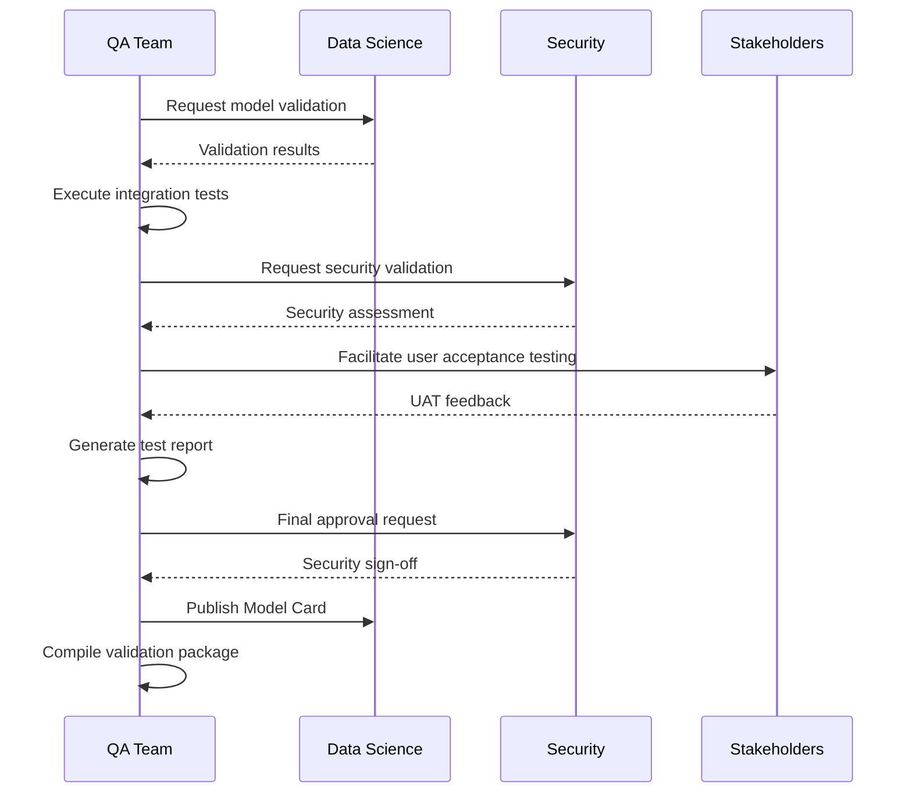

# Phase 5: Validation & Integration Test

## Purpose & Objectives

Phase 5 focuses on comprehensive validation and testing of the entire system, ensuring that individual components work correctly together and the system as a whole meets requirements. This phase verifies model performance, fairness, and privacy compliance while confirming that the mobile app, APIs, and backend services integrate seamlessly. The goal is to identify and resolve issues before deployment, providing confidence that the system is ready for production.

## Key Activities

### 1. Model Validation

- Validate model performance on independent test sets
- Assess model fairness across demographic groups
- Test model behavior with edge cases and adversarial inputs
- Evaluate privacy implications of model outputs
- Document model limitations and constraints
- Create comprehensive model cards for transparency

### 2. Integration Testing

- Test end-to-end flows across all system components
- Verify API contracts and error handling
- Test authentication and authorization flows
- Validate mobile app interactions with backend services
- Confirm data consistency across system boundaries
- Test offline functionality and sync processes

### 3. User Acceptance Testing

- Conduct structured UAT sessions with stakeholders
- Gather and prioritize feedback
- Verify that business requirements are met
- Test with realistic user scenarios and data
- Document any required changes or enhancements
- Validate accessibility compliance

### 4. Performance & Security Validation

- Conduct load and stress testing
- Perform penetration testing and security assessments
- Validate data protection measures
- Test disaster recovery procedures
- Verify monitoring and alerting functionality
- Measure system latency and throughput

## Roles & Responsibilities

| **Role**           | **Responsibility**                                          | **Participation Level** |
|--------------------|-------------------------------------------------------------|-------------------------|
| QA/Test Lead       | Test planning, execution, reporting                        | Active participation    |
| Security Officer   | Security validation, compliance verification               | Active participation    |
| Mobile QA Automation| Mobile app testing, UI automation                        | Active participation    |
| Data Scientist     | Model validation, fairness assessment                      | Advisory/support        |

## Technology Focus

- Appium, Detox, or Espresso for UI automation testing
- Postman collections for API testing
- Fairness and bias assessment tools (Aequitas, What-If Tool)
- AWS Device Farm for cross-device testing
- JMeter or Locust for load testing
- Privacy and security assessment frameworks

## Deliverables & Templates

### 1. Validation Checklist (5.1)
Comprehensive verification of model performance, bias, and privacy considerations.

### 2. Integration Test Matrix (5.2)
Structured documentation of all integration test cases, results, and coverage.

### 3. Model Card (5.3)
Transparent documentation of model characteristics, training data, performance metrics, intended use cases, and limitations.

### 4. Requirements Traceability Matrix (RTM)
Mapping of requirements to test cases and validation evidence.

### 5. User Acceptance Test Feedback Summary
Compilation of UAT results, stakeholder feedback, and resulting action items.

## Entry & Exit Criteria

### Entry Criteria:
- Built application binary ready for testing
- Packaged models and APIs in staging environment
- Completed build phase with passing unit tests
- Test plans and test cases documented

### Exit Criteria:
- Validation Report signed by QA Lead and Security Officer
- Model Card published to internal registry
- All critical and high-severity defects resolved
- UAT signed off by business stakeholders
- Performance test results meet defined thresholds

## Policy Compliance Hooks

### SDLC Policy Requirements
This phase fulfills the "Evaluate System Readiness" requirements by having independent testers validate acceptance criteria and security controls.

### Change Management Requirements
Test evidence must be attached to the Change Request Packet awaiting CCB review.

### Data Classification Requirements
Test datasets must be properly de-identified, and telemetry events must be appropriately labeled before test runs.

## Best Practices & Tips

- **Independent Testing**: Ensure testers are different from developers
- **Realistic Data**: Use production-like data (safely anonymized) for testing
- **Automated Testing**: Automate as many test cases as possible
- **Regression Focus**: Verify that new features don't break existing functionality
- **Document Everything**: Keep detailed records of test results and issues
- **User Perspective**: Test from end-user viewpoint, not just technical correctness

## Common Pitfalls

- Rushing validation due to timeline pressure
- Insufficient edge case testing
- Poor test coverage of error conditions
- Not testing with realistic data volumes
- Inadequate assessment of model fairness
- Failing to test non-functional requirements (performance, security)

---

## Phase 5 Workflow

