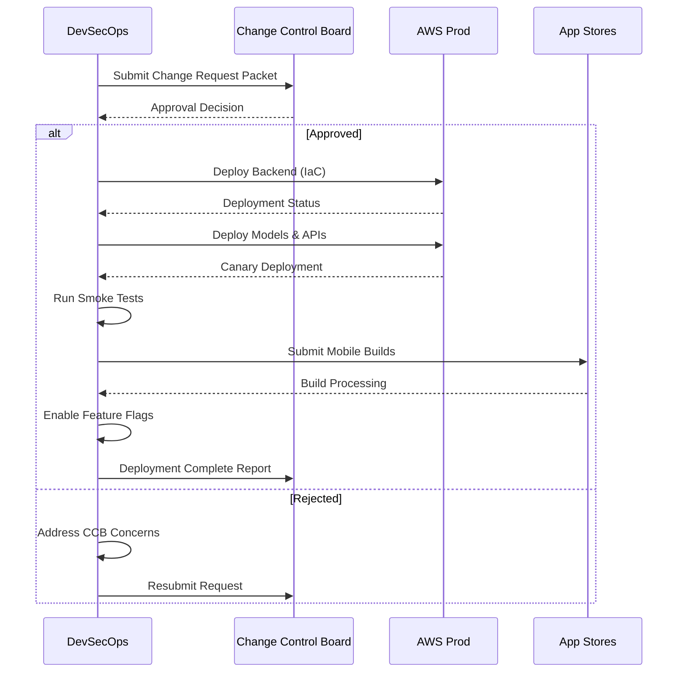

# Phase 6: Deployment & Release

## Purpose & Objectives

Phase 6 transitions the validated system from testing environments into production, following formal change-control processes and employing staged deployment strategies. This critical phase focuses on safely delivering the application and its underlying models to end users while minimizing risk and ensuring service continuity. The goal is to implement a controlled, monitored deployment that can be quickly rolled back if issues arise.

## Key Activities

### 1. Change Control Process

- Complete Change Request Packet with full impact analysis
- Present change to Change Control Board (CCB)
- Document approval decisions and conditions
- Schedule deployment within approved maintenance windows
- Notify affected stakeholders of upcoming changes
- Create detailed deployment timeline

### 2. Production Deployment

- Deploy model services (Lambda/ECS) and backend components
- Update infrastructure using Infrastructure as Code (IaC)
- Implement canary or blue-green deployment strategies
- Monitor system health during deployment
- Execute smoke tests to verify basic functionality
- Deploy database schema changes with rollback capability

### 3. Mobile App Release

- Submit mobile apps to TestFlight and Google Play Beta channels
- Conduct staged rollout to percentage of users
- Manage app store requirements and compliance
- Coordinate feature flag enablement with backend services
- Monitor initial user feedback and crash reports
- Prepare for full production release

### 4. Deployment Verification

- Execute post-deployment validation checks
- Verify monitoring systems are capturing metrics
- Confirm logging is working properly
- Test alerting thresholds and on-call procedures
- Validate security controls in production environment
- Document any deployment issues and resolutions

## Roles & Responsibilities

| **Role**           | **Responsibility**                                       | **Participation Level** |
|--------------------|----------------------------------------------------------|-------------------------|
| DevSecOps Engineer | Deployment execution, pipeline management               | Active participation    |
| CCB (CTO chair)    | Change approval, risk assessment                       | Active participation    |
| Mobile Dev Lead    | App store submission, release management               | Active participation    |
| System Admins      | Infrastructure support, environment configuration      | Advisory/support        |
| QA Lead           | Post-deployment validation, smoke testing              | Advisory/support        |

## Technology Focus

- AWS CodePipeline or similar CI/CD tools
- EKS, Lambda, or container orchestration platforms
- CloudFormation/CDK for infrastructure deployment
- Cognito or alternative auth services
- App Store Connect and Google Play Console
- Feature flag services (AWS AppConfig, LaunchDarkly)
- Monitoring and alerting tools

## Deliverables & Templates

### 1. Change Request Packet (6.1)
Comprehensive documentation of the proposed change, including impact assessment, ROI analysis, rollback procedures, and customer notification drafts.

### 2. Deployment Runbook (6.2)
Step-by-step procedures for deployment, including commands, verification steps, and rollback instructions.

### 3. Release & Rollback Plan (6.3)
Detailed timeline for release activities with go/no-go decision points and specific rollback procedures for each deployment stage.

## Entry & Exit Criteria

### Entry Criteria:
- Signed Validation Report from Phase 5
- Completed Change Request Packet
- All critical and high issues resolved
- Test environments validated
- Deployment runbooks reviewed and approved

### Exit Criteria:
- CCB approval formally logged
- Successful deployment to production
- Smoke tests passing in production environment
- Mobile apps available in beta/production channels
- Customer notifications sent if required
- Monitoring showing normal system behavior

## Policy Compliance Hooks

### SDLC Policy Requirements
This phase fulfills the "System Deployment Phase" by documenting training materials and user documentation for the deployed system.

### Change Management Requirements
All policy requirements must be met: human approval, documented rollback plan, audit logging, and separation of duties.

### Data Classification Requirements
Production IAM roles and permissions must enforce data classification controls, including encryption and access limitations.

## Best Practices & Tips

- **Automation**: Automate as much of the deployment process as possible
- **Incremental Rollout**: Use staged deployments to limit potential impact
- **Feature Flags**: Decouple deployment from feature activation
- **Observability**: Ensure comprehensive monitoring during deployment
- **Communication**: Keep all stakeholders informed of deployment status
- **Rehearse**: Practice deployments in staging environments before production

## Common Pitfalls

- Insufficient rollback planning leading to extended outages
- Missing dependencies or configuration issues in production
- Inadequate stakeholder notification causing support issues
- Failed database migrations without proper recovery steps
- Incomplete verification of deployed components
- Lack of coordination between mobile and backend deployments

---

## Phase 6 Workflow

