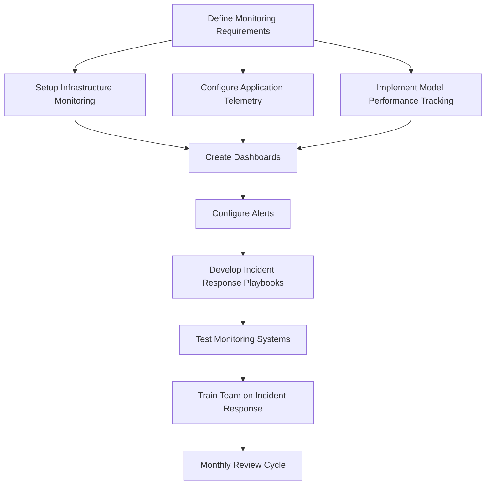

# Phase 7: Monitoring & Telemetry

## Purpose & Objectives

Phase 7 establishes comprehensive monitoring, alerting, and telemetry systems to ensure the deployed application and ML models perform reliably in production. This phase creates the observability infrastructure that allows the team to detect issues early, understand user behavior, track model performance, and respond quickly to incidents. The goal is to maintain system health while collecting meaningful data for continuous improvement.

## Key Activities

### 1. Dashboard & Monitoring Implementation

- Configure infrastructure monitoring (CPU, memory, network)
- Implement model performance tracking (drift, latency)
- Set up application health checks and SLA monitoring
- Create executive and operational dashboards
- Define and implement alerting thresholds
- Configure on-call rotation and escalation paths

### 2. Telemetry & Analytics Setup

- Implement user behavior tracking
- Configure crash and error reporting
- Set up A/B testing infrastructure
- Establish user feedback collection mechanisms
- Deploy session recording (with appropriate privacy controls)
- Implement data retention and anonymization policies

### 3. Security Monitoring

- Configure access and authentication logging
- Set up audit trails for sensitive operations
- Implement anomaly detection for security events
- Monitor for potential data exfiltration
- Track regulatory compliance metrics
- Establish SIEM integration where appropriate

### 4. Incident Response Preparation

- Create detailed incident response playbooks
- Define severity levels and response SLAs
- Establish communication templates and channels
- Set up war room procedures
- Schedule regular incident response drills
- Create post-mortem templates

## Roles & Responsibilities

| **Role**           | **Responsibility**                                       | **Participation Level** |
|--------------------|----------------------------------------------------------|-------------------------|
| DevSecOps          | Monitoring infrastructure, alerting configuration        | Active participation    |
| Mobile QA Automation| Mobile telemetry, crash reporting                       | Active participation    |
| Security Officer   | Security event monitoring, compliance tracking          | Active participation    |
| Data Scientist     | Model performance monitoring, drift detection           | Advisory/support        |

## Technology Focus

- AWS CloudWatch, Prometheus, or Grafana for monitoring
- Amazon Pinpoint or Firebase Analytics
- Sentry or similar for error tracking
- Model monitoring tools (SageMaker Model Monitor)
- Cognito logs and security event monitoring
- PagerDuty or OpsGenie for alerting and on-call

## Deliverables & Templates

### 1. Monitoring Dashboard Spec (7.1)
Documentation of all dashboard components, data sources, refresh intervals, and access controls.

### 2. Incident Response Playbook (7.2)
Detailed procedures for responding to various types of incidents, including communication protocols and escalation paths.

### 3. Mobile Telemetry Spec (7.3)
Documentation of all events tracked in mobile applications, their triggers, and the data collected.

## Entry & Exit Criteria

### Entry Criteria:
- Production deployment completed successfully
- System components operating normally
- Access to all required monitoring endpoints
- Defined KPIs and health metrics

### Exit Criteria:
- Monthly KPI and incident report framework established
- All critical alerts tested and verified
- Monitoring dashboards accessible to stakeholders
- Incident response playbooks reviewed and approved
- On-call rotation established and documented

## Policy Compliance Hooks

### SDLC Policy Requirements
This phase fulfills the "Operations & Maintenance" requirements implied in the policy through ongoing monitoring and operational support.

### Change Management Requirements
Incidents that trigger code changes must open new work items with proper tracking and prioritization.

### Data Classification Requirements
Telemetry event specifications must flag Restricted fields and apply appropriate encryption at rest for all collected data.

## Best Practices & Tips

- **Alert Rationalization**: Focus on actionable alerts to avoid alert fatigue
- **Dashboard Hierarchy**: Create dashboards for different audience levels (executive, operational, technical)
- **Testing Alerting**: Regularly test alert flows to ensure they work when needed
- **Privacy by Design**: Ensure telemetry respects user privacy and regulatory requirements
- **Historical Trending**: Implement historical data retention for trend analysis
- **Documentation**: Keep monitoring configuration and alert thresholds documented

## Common Pitfalls

- Alert fatigue from too many non-actionable notifications
- Missing critical metrics that could indicate system issues
- Inadequate model drift monitoring leading to declining performance
- Privacy violations in telemetry collection
- Insufficient logging during critical incidents
- Lack of correlation between frontend and backend metrics

---

## Phase 7 Workflow

