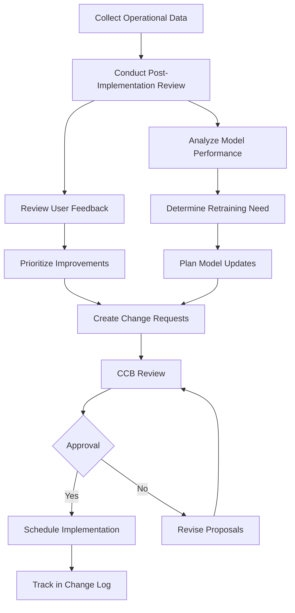

# Phase 8: Continuous Improvement

## Purpose & Objectives

Phase 8 establishes a structured approach to ongoing system enhancement based on operational data, user feedback, and changing requirements. This phase transforms the reactive monitoring of Phase 7 into proactive improvements, ensuring the system evolves to maintain optimal performance, security, and user satisfaction. The goal is to create a systematic process for evaluating system effectiveness and implementing targeted improvements.

## Key Activities

### 1. Post-Implementation Review

- Conduct formal evaluation of system against original objectives
- Gather stakeholder feedback on system performance
- Compare actual vs. projected metrics and ROI
- Analyze operational incidents and their root causes
- Review security posture and compliance status
- Document lessons learned for future projects

### 2. Model Performance Assessment

- Analyze model drift and performance degradation
- Evaluate need for retraining or model updates
- Review feature importance and data quality
- Assess fairness metrics across user populations
- Document model version performance
- Determine retraining frequency and triggers

### 3. User Experience Optimization

- Analyze user behavior and conversion metrics
- Review crash reports and error patterns
- Gather direct user feedback through surveys or interviews
- Identify UX friction points and bottlenecks
- Prioritize usability enhancements
- Plan A/B tests for proposed changes

### 4. System Evolution Planning

- Prioritize technical debt remediation
- Plan feature enhancements based on feedback
- Schedule infrastructure upgrades
- Develop scaling strategy for increased adoption
- Update security controls for emerging threats
- Coordinate release planning for improvements

## Roles & Responsibilities

| **Role**           | **Responsibility**                                       | **Participation Level** |
|--------------------|----------------------------------------------------------|-------------------------|
| Product Manager    | Feature prioritization, user feedback analysis          | Active participation    |
| CCB                | Change evaluation, release approval                     | Active participation    |
| Project Manager    | Planning coordination, resource allocation              | Active participation    |
| Data Scientist     | Model performance analysis, retraining planning         | Advisory/support        |
| Dev & Mobile Teams | Technical implementation planning, feasibility          | Advisory/support        |

## Technology Focus

- Jira, ClickUp, or similar for improvement tracking
- SageMaker Pipelines or ML automation for retraining
- Feature flag services for gradual rollout
- Analytics platforms for user behavior analysis
- A/B testing frameworks
- Automated retraining pipelines

## Deliverables & Templates

### 1. Post-Implementation Review (PIR) Form (8.1)
Structured assessment of the project against its original objectives, with lessons learned and improvement recommendations.

### 2. Change-Log (8.2)
Detailed record of all system changes, their rationale, impact, and responsible parties.

### 3. Retraining Decision Log (8.3)
Documentation of model monitoring results, retraining decisions, and performance improvements.

## Entry & Exit Criteria

### Entry Criteria:
- System in production with monitoring in place
- Sufficient operational data collected (typically 30-90 days)
- KPI reports available for analysis
- Stability achieved in production environment

### Exit Criteria:
- Completed PIR signed by key stakeholders
- Prioritized improvement backlog created
- Decisions made regarding model retraining
- Change requests for approved enhancements entered into tracking system

## Policy Compliance Hooks

### SDLC Policy Requirements
This phase feeds back into new "Determine Need" cycles, creating a continuous improvement loop in the SDLC.

### Change Management Requirements
Every remedial or enhancement item must restart the formal change control process with appropriate documentation and approvals.

### Data Classification Requirements
Any new data collection proposed must go through Phase 1 classification process before implementation.

## Best Practices & Tips

- **Data-Driven Decisions**: Base improvement priorities on metrics and user data
- **Regular Cadence**: Establish a consistent schedule for PIRs and improvement cycles
- **Stakeholder Input**: Include diverse perspectives in the improvement process
- **Technical Debt**: Balance new features with technical debt reduction
- **Documentation**: Keep comprehensive records of all system changes
- **External Evaluation**: Consider external audit or expert review periodically

## Common Pitfalls

- Focusing only on new features rather than stability and technical debt
- Delaying model retraining until performance significantly degrades
- Not allocating sufficient resources for improvement initiatives
- Failing to track the impact of implemented changes
- Skipping or rushing the PIR process
- Neglecting security improvements in favor of user-visible features

---

## Phase 8 Workflow

