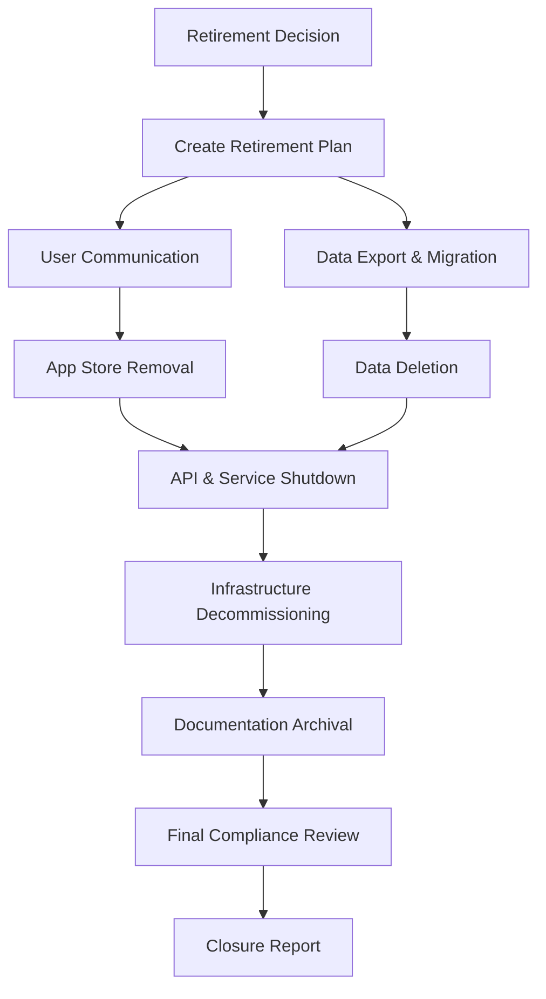

# Phase 9: Retirement & Archival

## Purpose & Objectives

Phase 9 provides a structured approach to safely decommissioning systems when they reach the end of their lifecycle. This final phase ensures proper shutdown of services, appropriate handling of data according to regulatory requirements, and preservation of relevant documentation and knowledge. The goal is to retire systems in a controlled manner that maintains compliance, prevents data loss or leakage, and facilitates knowledge transfer for future projects.

## Key Activities

### 1. Retirement Planning

- Determine retirement timeline and dependencies
- Identify replacement systems if applicable
- Create user communication strategy
- Plan for data migration or export
- Schedule shutdown of services and infrastructure
- Establish archival requirements for code and documentation

### 2. Data Handling & Compliance

- Inventory all data stores and classification levels
- Create data export procedures for portability
- Implement data deletion according to regulations
- Generate deletion verification evidence
- Document compliance with retention schedules
- Prepare final data protection impact assessment

### 3. Knowledge Transfer

- Document system architecture for historical reference
- Capture lessons learned and best practices
- Transfer maintenance knowledge to ongoing teams
- Archive codebase with appropriate documentation
- Preserve model cards and algorithmic documentation
- Create transition plans for user migration

### 4. Service Decommissioning

- Remove applications from stores
- Shutdown APIs and backend services
- Decommission infrastructure following IaC principles
- Revoke credentials and access permissions
- Archive logs and monitoring data
- Generate final decommissioning report

## Roles & Responsibilities

| **Role**           | **Responsibility**                                       | **Participation Level** |
|--------------------|----------------------------------------------------------|-------------------------|
| CTO                | Final retirement approval, resource allocation          | Active participation    |
| Security Officer   | Compliance verification, data deletion oversight        | Active participation    |
| DevSecOps Engineer | Technical decommissioning, infrastructure removal       | Active participation    |
| Legal/Compliance   | Regulatory requirement verification                     | Advisory/support        |

## Technology Focus

- S3 Glacier or equivalent for long-term archival
- AWS Backup or similar for final system snapshots
- App Store Connect and Play Console for app removal
- Data export tools (Parquet/JSON formats)
- Infrastructure as Code for controlled teardown
- Documentation archival systems

## Deliverables & Templates

### 1. Data Deletion & Portability Record (9.1)
Documentation confirming proper handling of all data, including exports provided and verification of deletion.

### 2. Decommission Checklist (9.2)
Step-by-step verification that all components have been properly shut down, removed, or archived.

### 3. Engineer Handover Template (9.3)
Knowledge transfer document with contact information, repository locations, and key system details.

### 4. Work-Item Status Definition Appendix
Reference document mapping workflow statuses to lifecycle phases for historical context.

### 5. Doc Ownership Matrix (1-pager)
Clear documentation of who owned each component of the system documentation.

## Entry & Exit Criteria

### Entry Criteria:
- Decision to retire system approved by leadership
- Replacement system in place (if applicable)
- Data export and migration plans approved
- Retirement timeline established

### Exit Criteria:
- CTO and Security Officer verification of proper archival and deletion
- Customer acknowledgments of system retirement
- All services and infrastructure components decommissioned
- Complete audit pack archived according to retention policy
- Final decommissioning report submitted

## Policy Compliance Hooks

### SDLC Policy Requirements
This phase fulfills the final step in the "System Deployment" phase (retirement) as documented in the SDLC policy.

### Change Management Requirements
A final change ticket must be created to close the release, and the audit trail must be kept for the required retention period (typically 7 years).

### Data Classification Requirements
Proof must be provided that Restricted data has been properly wiped or anonymized according to the defined retention schedule.

## Best Practices & Tips

- **Early Planning**: Begin retirement planning well before actual shutdown
- **Clear Communication**: Provide users with ample notice and transition options
- **Verify Deletion**: Use secure deletion methods and verify their effectiveness
- **Documentation Archive**: Preserve key documentation for future reference and audits
- **Staged Shutdown**: Consider phased decommissioning to minimize user impact
- **Exit Interviews**: Capture insights from team members before project conclusion

## Common Pitfalls

- Incomplete data export leading to information loss
- Failure to properly document the retirement process
- Not providing sufficient notice to users and stakeholders
- Incomplete infrastructure decommissioning leading to orphaned resources
- Inadequate preservation of key documentation and lessons learned
- Non-compliance with regulatory data retention requirements

---

## Phase 9 Workflow

